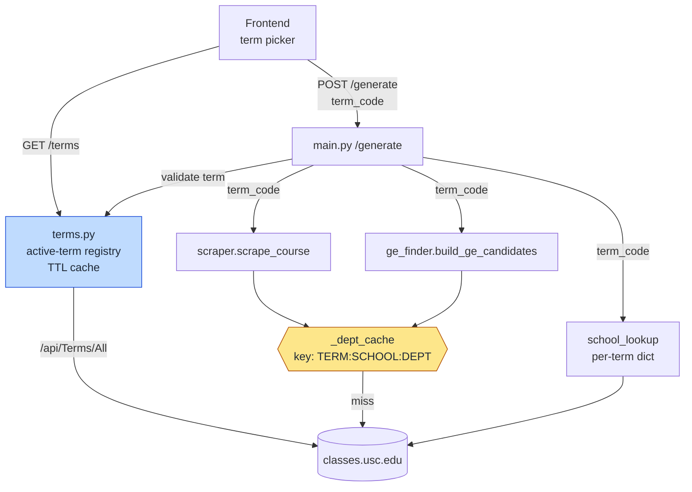

# feat: Multi-term schedule support

## Summary

Trojan Scheduler is pinned to Fall 2026 by a hardcoded `TERM_CODE` constant. This plan replaces that
pin with terms resolved live from USC's `/api/Terms/All` endpoint, threads a per-request term through
the backend, and adds a frontend term picker so a student can plan Spring while Fall is still open.
Course-autocomplete data becomes one static file per active term, regenerated on rollover.

---

## Problem Frame

`TERM_CODE` is a module-level constant in `backend/scraper.py`, read once at import and imported by
three other modules. "Which semester" is therefore baked in at process start. Consequences today:

- Every semester someone must edit an env var and redeploy, or the app silently serves a dead term.
  There is no error — USC returns empty or stale sections and the app reports "no schedules found".
- A student cannot plan for a term other than the one the deploy is pinned to, even though USC keeps
  three terms registerable at once.
- `frontend/public/courses.json` and `ge_courses.json` are per-term artifacts with no term marking,
  so autocomplete silently describes the wrong semester after any rollover.

USC exposes exactly the data needed to fix this. `/api/Terms/All` returns 81 terms, of which exactly
three carry `status: "Active"` (Spring, Summer, Fall 2026); the rest are `Archived`. Term codes are
`YYYY` + season digit (`1`=Spring, `2`=Summer, `3`=Fall). No date heuristics are required — USC
states which terms are registerable.

---

## Requirements

- **R1** — The backend resolves active terms from USC at runtime; no term is hardcoded in source.
- **R2** — A request may specify which active term to schedule against; omitting it uses a sensible default.
- **R3** — A term code outside USC's active set is rejected, rather than silently returning empty results.
- **R4** — Data cached for one term is never served for another.
- **R5** — The frontend lets a student choose among active terms and shows which term a schedule is for.
- **R6** — Course-autocomplete data matches the selected term.
- **R7** — Term rollover requires no source edit; new terms appear without a code change.

---

## Key Technical Decisions

### KTD1 — Resolve terms from `/api/Terms/All`, filtered on `status == "Active"`

Verified against the live endpoint: exactly three terms are `Active`, matching USC's registration
window. The alternative — deriving the term from the current date — reimplements USC's registration
calendar and drifts from it. Satisfies R1 and R7.

### KTD2 — Term becomes a parameter, not a module constant

`TERM_CODE` is deleted from `backend/scraper.py`. Every function that reaches USC takes an explicit
`term_code`. This is mechanical but wide: it touches every call site in `scraper.py`, `ge_finder.py`,
and both generator scripts. Making it a mutable global instead would reintroduce the same bug class
under concurrency — two in-flight requests for different terms would race on the same global.

### KTD3 — Term goes into every cache key

`_dept_cache` is currently keyed `"SCHOOL:DEPT"`. Once term is per-request this key collides across
terms and serves Fall catalogs to a Spring request — silently, with plausible-looking data. The key
becomes `"TERM:SCHOOL:DEPT"`. `school_lookup` moves from a single startup dict to a per-term dict,
and the GE warmer warms per active term. Satisfies R4. See Risks.

### KTD4 — Default term is the latest active one

With three active terms, the default is the highest term code (the furthest-out registration target),
which is what a student planning ahead most likely wants. The picker makes the other two reachable,
so this default is a convenience, not a constraint.

### KTD5 — One static course list per active term

Reconciles a picker over three terms with static CDN-served data. Files become
`frontend/public/courses.<termCode>.json` and `ge_courses.<termCode>.json`; the frontend fetches the
file matching the selected term. Keeps the current fast static load and avoids a new backend request
path, at the cost of a regeneration step. Satisfies R6.

### KTD6 — Rollover regeneration runs on a schedule in CI

The repo has no CI today. A scheduled GitHub Action runs the generators, and opens a PR when the
active-term set changes. A PR rather than a direct commit keeps a human in the loop on a 280KB data
change, and Vercel redeploys on merge. Satisfies R7.

---

## High-Level Technical Design

Term threading through the request path. Bold edges carry the term code.



The amber node is the correctness-critical one: it is the only place where two terms' data can be
confused, and the confusion is silent.

Term code shape, used for display and ordering:

```
20263
└┬──┘│
 │   └── season: 1=Spring, 2=Summer, 3=Fall
 └────── calendar year
```

---

## Implementation Units

### U1. Active-term registry

**Goal:** A single source of truth for which terms exist and which is the default.
**Requirements:** R1, R3, R7
**Dependencies:** none
**Files:**
- `backend/terms.py` (new)
- `backend/test_terms.py` (new)
- `backend/main.py` (add `GET /terms`)

**Approach:** Fetch `/api/Terms/All`, keep entries where `status == "Active"`, sort by term code
descending. Expose the list, a default (highest code), and a validity check. Cache in-process with a
TTL long enough that this is not a per-request fetch (a day is appropriate — USC's active set changes
a few times a year) but short enough to pick up a rollover without a redeploy. Derive a display label
from the term code's season digit rather than trusting a free-text field. `GET /terms` returns the
active list plus the default so the frontend does not duplicate the ordering rule.

**Patterns to follow:** TTL-cache shape in `backend/scraper.py` (`_dept_cache`, module-level dict of
`(fetched_at, value)`); env-overridable TTL constant as in `DEPT_CACHE_TTL`.

**Test scenarios:**
- Given a payload with mixed `Active`/`Archived` entries, only the active ones are returned.
- Active terms are ordered newest-first, and the default is the highest term code.
- A known-archived code (`20253`) is rejected by the validity check; an active one (`20263`) passes.
- Term codes map to the right label: `20261`→Spring 2026, `20262`→Summer 2026, `20263`→Fall 2026.
- A second call inside the TTL does not re-issue the HTTP request.
- A call after the TTL expires re-fetches.
- When USC is unreachable and a cached list exists, the stale list is served rather than raising —
  a scheduler that plans last semester beats one that returns 500.
- When USC is unreachable and no cache exists, the failure surfaces as an explicit error.

**Verification:** `GET /terms` on a running backend returns the three active 2026 terms with the
default marked, and no term code appears in backend source.

---

### U2. Thread term through the scraper and its caches

**Goal:** Remove the `TERM_CODE` constant; make term an explicit argument and part of every cache key.
**Requirements:** R1, R4
**Dependencies:** U1
**Files:**
- `backend/scraper.py`
- `backend/test_scraper.py`

**Approach:** Delete `TERM_CODE`. Add a `term_code` parameter to `build_school_lookup`,
`_get_dept_courses`, `scrape_course`, and `fetch_dept_courses`. Change the `_dept_cache` key from
`"SCHOOL:DEPT"` to `"TERM:SCHOOL:DEPT"`. `lookup_section_in_cache` currently scans every cache value
and would therefore match a section from any term — it needs a term argument and must only scan
entries for that term. Give `clear_dept_cache` an optional term so one term can be invalidated alone.

**Execution note:** `test_scraper.py` has no test functions today. Add characterization coverage for
current single-term fetch behavior before changing the signatures, so the refactor is provably
behavior-preserving for the existing path.

**Patterns to follow:** existing `_get_dept_courses` TTL check and cache-write shape.

**Test scenarios:**
- Fetching a department for term A then term B issues two HTTP requests, not one.
- Cached term-A data is not returned for a term-B request with the same school and department.
- A repeat request for the same term within the TTL is served from cache without an HTTP call.
- `lookup_section_in_cache` finds a section ID present in the requested term.
- `lookup_section_in_cache` returns `None` for a section ID that exists only in a *different* term's
  cache entry — this is the cross-term leak the term-scoped key exists to prevent.
- `clear_dept_cache(term)` drops only that term's entries; other terms survive.
- `build_school_lookup` issues its request with the term code it was given.

**Verification:** No reference to `TERM_CODE` remains in `backend/scraper.py`, and the cross-term
cache tests fail if the term is removed from the cache key.

---

### U3. Thread term through GE discovery and warming

**Goal:** GE candidate pools and the startup warmer operate per term.
**Requirements:** R1, R4
**Dependencies:** U2
**Files:**
- `backend/ge_finder.py`
- `backend/main.py`
- `backend/test_ge_finder.py` (new)

**Approach:** Replace the `TERM_CODE` import with a `term_code` parameter on `fetch_ge_course_codes`,
`warm_ge_departments`, and `build_ge_candidates`. In `main.py`, `school_lookup` becomes a per-term
mapping built lazily on first use of a term and held for the process; `_ge_warmer_loop` iterates the
active terms. Warming three terms at startup triples the cold-start cost, so warm the default term
first and the others in the background — a request for a non-default term should not wait behind
warming for terms nobody asked for.

`CATEGORY_PREFIX_MAP` stays hardcoded. It was verified byte-identical across all three active terms
(`/api/Ge/TermCode` responses are identical once the echoed `termCode` field is removed), so deriving
it dynamically would add a fetch for data that does not vary. See Assumptions.

**Patterns to follow:** existing `warm_ge_departments` semaphore-bounded `asyncio.gather`; lifespan
task management in `backend/main.py`.

**Test scenarios:**
- `fetch_ge_course_codes` issues its request with the given term code.
- `build_ge_candidates` for term A and term B produce independently-cached pools.
- GE candidate sections for a term carry only that term's sections.
- The warmer covers every active term, and a warm failure for one term does not abort the others
  (the current loop already swallows per-dept failures — preserve that at the term level).
- `school_lookup` is built once per term and reused, not rebuilt per request.

**Verification:** Startup logs show the school lookup and GE warm completing per active term; a GE
request against a non-default term returns that term's courses.

---

### U4. Accept and validate a term on the API

**Goal:** `/generate` and `/course-options` operate on a caller-specified, validated term.
**Requirements:** R2, R3
**Dependencies:** U1, U2, U3
**Files:**
- `backend/main.py`
- `backend/test_main_terms.py` (new)

**Approach:** Add optional `term_code` to `GenerateRequest`, defaulting to the registry's default when
omitted so existing clients keep working. Add a `term` query parameter to `/course-options`. Validate
against the active set before any scraping and return a clear error naming the valid terms — R3's
whole point is that an invalid term must not present as "no schedules found". Echo the resolved term
in the `/generate` response so the frontend can label results with the term actually used rather than
the one it believes it asked for.

**Patterns to follow:** existing Pydantic models and optional-field defaults in `backend/main.py`;
the structured `{"schedules": [], "error": ...}` error shape returned by the solver.

**Test scenarios:**
- A request omitting `term_code` resolves to the registry default.
- A request naming an active non-default term scrapes against that term.
- A request naming an archived term (`20253`) returns a validation error naming the valid terms, and
  performs no scraping.
- A malformed term code (`"fall"`, `""`, `999`) is rejected with the same clear error.
- `/course-options` honors its `term` parameter and rejects an invalid one.
- The `/generate` response echoes the resolved term code.
- Two concurrent requests for different terms each return their own term's sections — the regression
  test for the cache-key risk at the API boundary.

**Verification:** `curl` against a running backend for an archived term returns a validation error,
not an empty schedule list.

---

### U5. Term picker in the UI

**Goal:** A student selects a term and sees which term a schedule belongs to.
**Requirements:** R2, R5, R6
**Dependencies:** U4
**Files:**
- `frontend/lib/types.ts`
- `frontend/app/page.tsx`
- `frontend/components/InputForm.tsx`
- `frontend/components/ScheduleImageCard.tsx`

**Approach:** Add `term_code` to `GenerateRequest` and a `Term` type mirroring `GET /terms`; these
types are the only documentation of the API contract, so they move in lockstep with U4. Fetch the
active terms on mount, default to the server-provided default, and include the selection in the
submit payload. Thread the term through the linked-section resubmit path in `callGenerate` — that
path rebuilds the payload and would otherwise drop the selection on the second round-trip. Surface
the term on results so a schedule is never ambiguous about which semester it is for.

Place the selector alongside the existing Planning Mode toggle in the top-right of the content area.
That row is already established as the global-mode area rather than part of the form, and term is the
same kind of control. Match its visual treatment rather than inventing a second one.

**Patterns to follow:** Planning Mode toggle placement and styling in `frontend/components/InputForm.tsx`;
existing `NEXT_PUBLIC_BACKEND_URL` fetch shape in `frontend/app/page.tsx`.

**Test expectation:** manual verification — the repo has no frontend test setup, and adding one is
out of scope for this plan. Verification below is explicit as a result.

**Verification:**
- The picker lists the three active terms with readable labels, defaulted to the server's default.
- Generating with a non-default term returns that term's sections.
- Answering a linked-section prompt preserves the term across the resubmit.
- Results visibly state their term.
- `npm run build` and `npm run lint` pass.

---

### U6. Per-term course lists and rollover automation

**Goal:** Autocomplete data matches the selected term and follows rollover without a source edit.
**Requirements:** R6, R7
**Dependencies:** U1
**Files:**
- `backend/generate_course_list.py`
- `backend/generate_ge_course_list.py`
- `frontend/public/courses.<termCode>.json` (generated)
- `frontend/public/ge_courses.<termCode>.json` (generated)
- `frontend/components/InputForm.tsx`
- `.github/workflows/refresh-course-lists.yml` (new)

**Approach:** Both generators take a term argument and write term-suffixed filenames, looping over the
active terms by default. Preserve the existing shrink guard and its `--force` override — it exists
because the USC API silently truncates, and a per-term loop multiplies the chance of hitting that.
Keep the generators sequential for the same reason; the header comment in `generate_course_list.py`
documents the concurrency truncation bug and it still applies.

The frontend loads the file matching the selected term. Because a term's file may be absent between a
rollover and the regeneration PR merging, handle a missing file as "autocomplete unavailable for this
term" rather than letting a failed fetch break the form.

The scheduled workflow regenerates and opens a PR when the output changes. Weekly is the right cadence
— USC's active set changes a few times a year, and a PR that appears weekly with no diff is noise.

**Test scenarios:**
- A generator invoked for a specific term writes to that term's filename.
- The generator run across active terms produces one file pair per term.
- The shrink guard still refuses to overwrite when a term's course count drops, and `--force` still
  overrides it.
- Frontend selects the course file matching the chosen term.
- A missing course file for a term degrades to unavailable autocomplete without breaking submission.

**Verification:** One `courses.*.json` and `ge_courses.*.json` pair exists per active term; the
workflow runs green on manual dispatch and opens a PR only when content changed.

---

## Scope Boundaries

**In scope:** term resolution, per-request term threading, term-scoped caching, term validation, the
term picker, per-term course lists, rollover automation.

### Deferred to Follow-Up Work
- **Archived-term browsing.** USC exposes 78 archived terms. Scheduling against a past term has no
  registration value; browsing history is a different feature.
- **Frontend test setup.** U5 is manually verified because no frontend test infrastructure exists.
  Adding one is worth doing and is not this plan's job.
- **`InputForm.tsx` decomposition.** The file is 2300+ lines and U5 adds to it. Splitting it is a
  refactor with its own risk profile.
- **Input validation on the form.** Empty submissions still reach the backend. Pre-existing.

**Not in scope:** the solver, scoring, RMP enrichment. Professor ratings are term-independent, so the
RMP disk cache needs no term key.

---

## Risks & Mitigations

| Risk | Impact | Mitigation |
|---|---|---|
| Cross-term cache leak — a term missed in a cache key serves one term's catalog for another | High. Silent and plausible: wrong sections, wrong seats, no error | Term in every cache key (KTD3); dedicated cross-term tests in U2, U3, U4 that fail if the term is dropped from the key |
| Startup cost triples when warming three terms | Medium. Slow cold start on Railway; first request may time out | Warm the default term first, others in background (U3) |
| USC changes the terms endpoint or `status` values | High. Term resolution stops working | Serve the stale cached list on fetch failure (U1); failure is logged rather than silent |
| USC API truncates under concurrent load | Medium. Silently undercounted course lists | Keep generators sequential; preserve the shrink guard (U6) |
| Course-list file missing for a term between rollover and PR merge | Low. Autocomplete unavailable for that term | Degrade gracefully rather than breaking the form (U6) |

---

## Assumptions

- **GE category map is term-stable.** Verified: `/api/Ge/TermCode` is byte-identical across 20261,
  20262, and 20263 once the echoed `termCode` is removed. If USC revises GE requirements for a future
  term, `CATEGORY_PREFIX_MAP` in `backend/ge_finder.py` would need revisiting — U3 leaves it hardcoded
  on the strength of this check, not an assumption.
- **`status: "Active"` means registerable.** Inferred from the current set matching USC's open
  registration window, not from documentation. If it proves broader, KTD4's default still resolves to
  the newest term.
- **Three concurrent active terms is the steady state.** Observed, not guaranteed. Nothing in the plan
  assumes the count; the code iterates whatever USC returns.

---

## Open Questions (Execution-Time)

- Exact TTL for the term registry. A day is proposed; tune once rollover behavior is observed.
- Whether per-term `school_lookup` should be built eagerly for all active terms at startup or lazily
  on first use. Depends on the cold-start cost measured in U3.
- Whether the GE warmer should warm non-default terms at all, or only on first request for them.

---

## Sources

- `https://classes.usc.edu/api/Terms/All` — 81 terms, 3 `Active`; verified 2026-09-11
- `https://classes.usc.edu/api/Ge/TermCode?termCode=...` — compared across all active terms; identical
- `backend/scraper.py`, `backend/ge_finder.py`, `backend/main.py` — current term handling and caches
